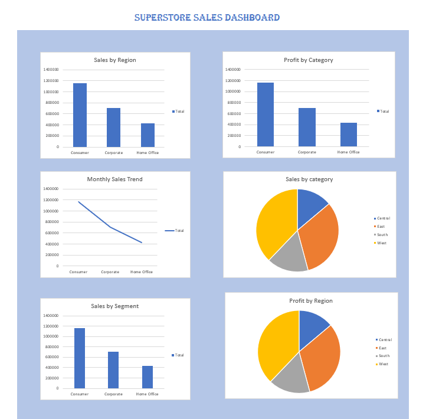

# Superstore Sales Dashboard (Excel Project)

## Project Overview
This project analyzes the Superstore dataset using Microsoft Excel to generate insights on sales and profit performance.

## Tools Used
- Microsoft Excel
- Pivot Tables
- Charts
- Dashboard Design

## Key Insights
- Sales distribution across regions
- Profit analysis by category
- Customer segment performance
- Monthly sales trends

## Dashboard Preview

## Files Included
- Dataset (Sample Superstore)
- Excel Dashboard File
